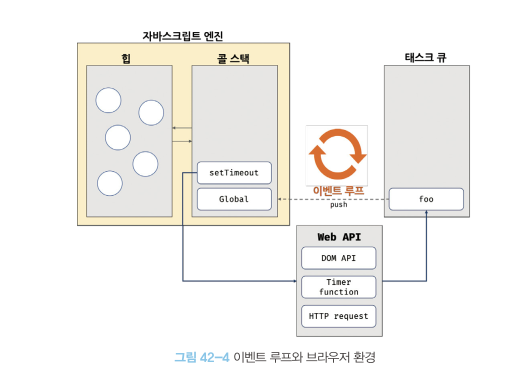

# 42장 비동기 프로그래밍

## 42.1 동기 처리와 비동기 처리

함수의 실행은 실행 컨텍스트 스택에 푸쉬되어야 한다.
함수가 호출된 순서대로 실행되는 이유는 함수가 호출된 순서대로 함수 실행 컨텍스트 스택에 푸쉬되기 떄문이다.

자바스크립트 엔진은 단 하나의 실행 컨텍스트 스택을 갖는다.
한번에 하나의 태스크만 실행할 수 있는 싱글 스레드 방식으로 동작한다.

처리가 오래 걸리는 태스크를 실행하는 경우 블로킹(작업 중단)이 발생한다.

동기 처리 -> 현재 실행 중인 태스크가 종료할 때까지 다음 테스크가 대기함
비동기 처리 -> 현재 실행 중인 태스크가 종료되지 않더라도 다음 태스크를 바로 실행하는 방식

setTimeout, setInterval, HTTP 요청, 이벤트 핸들러는 비동기 처리 방식으로 동작함

## 42.2 이벤트 루프와 태스크 큐

자바스크립트의 동시성을 지원하는 것은 이벤트 루프다



- 콜 스택
  실행 컨텍스트 스택

- 힙
  객체가 저장되는 메모리 공간
  실행 컨텍스트는 힙에 저장된 객체를 참조함

자바스크립트 엔진은 태스크 요청시 콜 스택을 통해 작업을 순차적으로 실행하는 역할만 담당함
비동기 처리에서 소스코드 평가, 실행을 제외한 모든 처리는 브라우저 또는 Node.js가 담당함

브라우저가 제공하는 태스크 큐와 이벤트 루프

- 태스크 큐
  비동기 함수의 콜백 함수, 이벤트 핸들러가 일시적으로 보관되는 영역
- 이벤트 루프

```javascript
function foo() {
  console.log("foo");
}

function bar() {
  console.log("bar");
}

setTimeout(foo, 0);
bar();
```

1. 전역 코드가 평가돼 전역 실행 컨텍스트가 생서돼 콜 스택에 푸쉬됨
2. 전역 코드가 실행돼 setTimtout 함수가 호출된다. setTimeout의 함수 실행 컨텍스트가 생성되고 콜 스택에 푸쉬되어 현재 실행중인 실행 컨텍스트가 됨.
   (브라우저의 Web API인 타이머 함수도 실행 컨텍스트를 실행한다.)
3. setTimout 함수 실행시 콜백 함수를 호출 스케줄링하고 죵료돼 콜 스택에서 팝 된다.
   호출 스케줄링(타이머 설정, 타이머 만료시 콜백 함수를 태스크 큐에 푸시하는것)은 브라우저의 역할이다.
4. 4-1은 브라우저가 수행하고 4-2는 자바스크립트 엔진이 수행하는데, 둘은 병행처리된다.
   4-1 브라우저는 타이머를 설정하고 타이머 만료시 콜백 함수 foo가 태스크 큐에 푸시된다.
   위의 예제에서는 지연 시간이 0이지만 지연 시간이 4ms인 경우는 최소 지연 시간 4ms가 지정된다.
   4ms 뒤에 콜백 함수인 foo가 태스크 큐에 푸쉬되어 대기한다
   지연 시간 후에 콜백 함수가 태스크 큐에 푸쉬되어 대기하지만 콜 스택이 비어야 호출되므로 시간차가 발생할 수 있다.

   4-2 bar 함수가 호출되어 bar 함수 실행 컨텍스트가 생성되고 콜 스택에 푸쉬되어 현재 실행 중인 실행 컨텍스트가 된다.
   bar 함수가 종료되어 콜 스택에서 팝 된다. 이떄 브라우저가 타이머를 설정한 후 4ms 경과했다면 foo 함수는 아직 태스크 큐에서 대기 중이다.

5. 전역 코드 실행이 종료되고 전역 실행 컨텍스트가 콜 스택에서 팝된다.
6. 이벤트 루프에 의해 콜 스택이 비어 있음이 감지되고 태스크 큐에서 대기중인 콜백 함수 foo가 이벤트 루프에 의해 콜 스택에 푸쉬된다.
   foo 함수 실행 컨텍스트가 생성되고 콜 스택에 푸쉬되어 현재 실행중인 실행 컨텍스트가 된다. 이후 foo 함수가 종료되어 콜 스택에서 팝된다.

주의할점은 자바스크립트가 싱글 스레드로 동작하는것이 아니라 자바스크립트 엔진이 싱글 스레드로 동작한다는 것이고 브라우저는 멀티 스레드로 동작한다.
